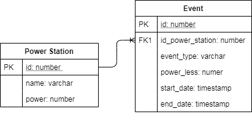

# PowerStation-Events
Power Station Events
## Table of contents
* [General info](#general-info)
* [Screenshots](#screenshots)
* [Technologies](#technologies)

## General info
REST API for the two  tables.

## Screenshots

	
## Technologies
Project is created with:
* Intellij IDEA 2020.1: Ultimmate
* Spring framework: 2.1.2.RELEASE
* Maven
* MySQL data base
